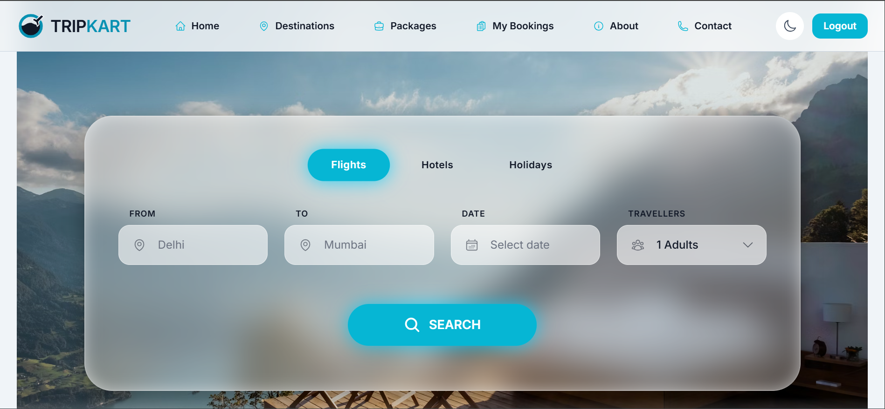

# Internship Task 3 – MakeMyTrip Rebrand Website

## 📌 Project Overview
This project is part of my **Full Stack Web Development Internship (Task 3)**.  
The objective of this task was to **rebrand and develop a travel booking website**, improving the UI/UX, implementing booking flow, payment integration, and creating responsive pages for a seamless user experience.

## ✨ Features
- Home page with deals and offers carousel  
- Destinations listing and detailed pages  
- Booking flow with date selection, guest & room management  
- Payment integration using Razorpay  
- Success page after booking confirmation  
- User dashboard for managing bookings  
- Footer with dynamic links and social media integration  
- Additional trust pages: Privacy Policy, Terms & Conditions, Customer Support  
- Fully responsive design across mobile, tablet, and desktop  

## 🛠️ Technologies Used

### Frontend
- React.js  
- Tailwind CSS  
- React Router DOM  
- Firebase (Firestore)  

### Backend / Services
- Firebase Firestore for bookings and deals  
- Razorpay for payment processing  

## 🌐 Live Demo
🔗 [MakeMyTrip Rebrand Website](https://tripkart-nine.vercel.app/) 

## 📸 Screenshots

## 🚀 Learning Outcome
- Building complex booking flows with React and Firebase  
- Integrating third-party payment gateway (Razorpay)  
- Designing fully responsive pages for mobile-first experience  
- Implementing dynamic content fetching from Firestore  
- Structuring reusable components and layouts  
- Creating trust and legal pages for user confidence  

## 📂 Internship Task Details
- **Task Number:** 03  
- **Task Name:** MakeMyTrip Rebrand Website
